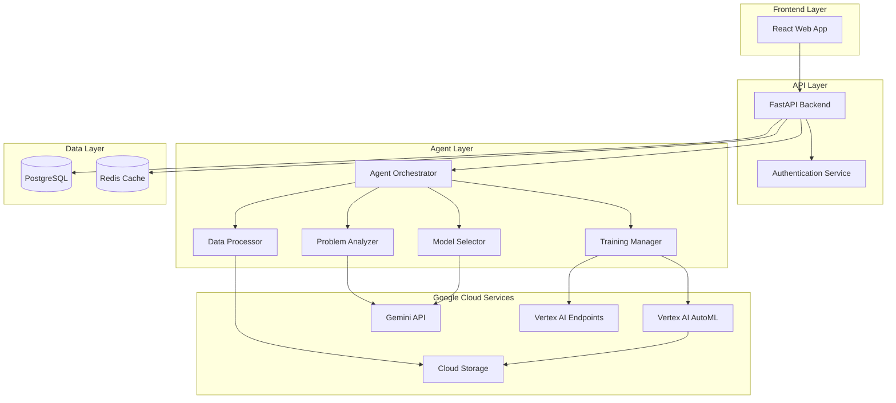

# Design Document

## Overview

The Agentic Model Training Platform is a full-stack web application that leverages Google Cloud's Vertex AI to provide autonomous machine learning model training. The system uses a microservices architecture with a React frontend, FastAPI backend, and an intelligent agent orchestrator powered by Gemini models. The platform automates the entire ML pipeline from data ingestion to model deployment, making ML accessible to non-experts.

## Architecture

### High-Level Architecture



### Technology Stack

**Frontend:**
- React 18 with TypeScript
- Material-UI for component library
- React Query for state management and API calls
- WebSocket for real-time progress updates

**Backend:**
- FastAPI (Python 3.11+)
- Pydantic for data validation
- SQLAlchemy for ORM
- Celery for async task processing
- WebSocket support via FastAPI WebSockets

**Agent System:**
- Google Gemini 1.5 Pro for reasoning and decision-making
- LangChain for agent orchestration
- Custom decision trees for model selection logic

**Cloud Infrastructure:**
- Google Cloud Vertex AI for model training
- Google Cloud Storage for data and model artifacts
- Cloud Run for containerized deployment
- Cloud SQL (PostgreSQL) for metadata storage
- Redis (Memorystore) for caching and job queues

## Components and Interfaces

### 1. Frontend Components

#### Main Application Component
```typescript
interface AppState {
  user: User | null;
  currentProject: Project | null;
  websocketConnection: WebSocket | null;
}
```

#### Project Submission Form
```typescript
interface ProjectSubmission {
  problemDescription: string;
  dataFiles: File[];
  dataType?: 'image' | 'text' | 'tabular' | 'multimodal';
  requiresApproval: boolean;
}
```

#### Progress Dashboard
```typescript
interface PipelineProgress {
  projectId: string;
  currentStage: PipelineStage;
  stageProgress: number;
  estimatedTimeRemaining: number;
  logs: LogEntry[];
  decisions: DecisionLog[];
}

enum PipelineStage {
  ANALYZING = 'analyzing',
  DATA_PROCESSING = 'data_processing',
  LABELING = 'labeling',
  MODEL_SELECTION = 'model_selection',
  TRAINING = 'training',
  EVALUATION = 'evaluation',
  DEPLOYMENT = 'deployment',
  COMPLETED = 'completed',
  FAILED = 'failed'
}
```

#### Results Display
```typescript
interface ModelResults {
  modelId: string;
  downloadUrl: string;
  apiEndpoint: string;
  metrics: PerformanceMetrics;
  report: ModelReport;
  codeExamples: CodeExamples;
}
```

### 2. Backend API Endpoints

#### Project Management
```python
POST /api/v1/projects
  Request: ProjectSubmission
  Response: Project

GET /api/v1/projects/{project_id}
  Response: Project

GET /api/v1/projects/{project_id}/progress
  Response: PipelineProgress

WS /api/v1/projects/{project_id}/stream
  Streams: ProgressUpdate events
```

#### Model Management
```python
GET /api/v1/models/{model_id}
  Response: ModelResults

GET /api/v1/models/{model_id}/download
  Response: Binary model file

POST /api/v1/models/{model_id}/predict
  Request: PredictionInput
  Response: PredictionOutput
```

#### Data Management
```python
POST /api/v1/data/upload
  Request: Multipart file upload
  Response: DatasetMetadata

GET /api/v1/data/{dataset_id}/preview
  Response: DataPreview
```

### 3. Agent Orchestrator

The Agent Orchestrator is the core intelligence of the platform, coordinating all pipeline stages.

```python
class AgentOrchestrator:
    def __init__(self, gemini_client, vertex_client):
        self.gemini = gemini_client
        self.vertex = vertex_client
        self.analyzer = ProblemAnalyzer(gemini_client)
        self.data_processor = DataProcessor()
        self.model_selector = ModelSelector(gemini_client)
        self.training_manager = TrainingManager(vertex_client)
    
    async def execute_pipeline(self, project: Project) -> ModelResults:
        """Main pipeline execution flow"""
        pass
```

#### Problem Analyzer
```python
class ProblemAnalyzer:
    async def analyze_problem(self, description: str, data_sample: Any) -> ProblemAnalysis:
        """
        Uses Gemini to understand:
        - Problem type (classification, regression, detection, etc.)
        - Domain (medical, business, agriculture, etc.)
        - Data characteristics
        - Success criteria
        """
        pass

@dataclass
class ProblemAnalysis:
    problem_type: ProblemType
    domain: str
    data_type: DataType
    suggested_metrics: List[str]
    complexity_score: float
    reasoning: str
```

#### Data Processor
```python
class DataProcessor:
    async def process_data(self, dataset: Dataset, analysis: ProblemAnalysis) -> ProcessedData:
        """
        - Validates data quality
        - Handles missing values
        - Performs feature engineering
        - Splits into train/val/test
        - Uploads to GCS
        """
        pass

    async def handle_unlabeled_data(self, dataset: Dataset, analysis: ProblemAnalysis) -> LabelingStrategy:
        """
        Determines labeling approach:
        - Zero-shot with Gemini
        - Few-shot learning
        - Transfer learning from similar datasets
        - Weak supervision
        """
        pass
```

#### Model Selector
```python
class ModelSelector:
    async def select_model(self, analysis: ProblemAnalysis, data: ProcessedData) -> ModelConfig:
        """
        Uses Gemini reasoning + rule-based logic to select:
        - Model architecture (CNN, Transformer, XGBoost, etc.)
        - Vertex AI AutoML type
        - Initial hyperparameters
        """
        pass

@dataclass
class ModelConfig:
    architecture: str
    vertex_ai_type: str
    hyperparameters: Dict[str, Any]
    training_budget_hours: int
    reasoning: str
```

#### Training Manager
```python
class TrainingManager:
    async def train_model(self, config: ModelConfig, data: ProcessedData) -> TrainingJob:
        """
        - Creates Vertex AI training job
        - Monitors progress
        - Handles failures and retries
        """
        pass
    
    async def evaluate_and_iterate(self, job: TrainingJob, max_iterations: int = 5) -> Model:
        """
        - Evaluates on validation set
        - Decides if iteration needed
        - Adjusts hyperparameters
        - Retrains if necessary
        """
        pass
    
    async def deploy_model(self, model: Model) -> Endpoint:
        """
        - Deploys to Vertex AI Endpoint
        - Configures autoscaling
        - Returns API endpoint URL
        """
        pass
```

### 4. Data Models

#### Database Schema

```python
class User(Base):
    __tablename__ = "users"
    
    id: UUID
    email: str
    created_at: datetime
    projects: List[Project]

class Project(Base):
    __tablename__ = "projects"
    
    id: UUID
    user_id: UUID
    problem_description: str
    status: PipelineStage
    created_at: datetime
    updated_at: datetime
    dataset_id: UUID
    model_id: Optional[UUID]
    audit_log: List[AuditEntry]

class Dataset(Base):
    __tablename__ = "datasets"
    
    id: UUID
    project_id: UUID
    data_type: DataType
    file_paths: List[str]  # GCS paths
    size_bytes: int
    num_samples: int
    is_labeled: bool
    metadata: Dict

class Model(Base):
    __tablename__ = "models"
    
    id: UUID
    project_id: UUID
    architecture: str
    vertex_job_id: str
    endpoint_url: Optional[str]
    artifact_path: str  # GCS path
    metrics: Dict
    created_at: datetime

class AuditEntry(Base):
    __tablename__ = "audit_entries"
    
    id: UUID
    project_id: UUID
    timestamp: datetime
    stage: PipelineStage
    decision_type: str
    decision: str
    reasoning: str
    confidence: float
```

## Error Handling

### Error Categories

1. **User Input Errors**
   - Invalid data format
   - Insufficient data
   - Unclear problem description
   - Response: Clear error message with suggestions

2. **Processing Errors**
   - Data corruption
   - Feature engineering failures
   - Response: Retry with fallback strategies

3. **Training Errors**
   - Vertex AI job failures
   - Resource quota exceeded
   - Model convergence issues
   - Response: Automatic retry with adjusted parameters (up to 3 attempts)

4. **Deployment Errors**
   - Endpoint creation failures
   - Model serving errors
   - Response: Retry deployment, fallback to downloadable model only

### Error Handling Strategy

```python
class ErrorHandler:
    async def handle_error(self, error: Exception, context: PipelineContext) -> ErrorResolution:
        """
        - Logs error to audit trail
        - Determines if recoverable
        - Attempts automatic recovery
        - Notifies user if manual intervention needed
        """
        if isinstance(error, RecoverableError):
            return await self.attempt_recovery(error, context)
        else:
            return await self.fail_gracefully(error, context)
```

## Testing Strategy

### Unit Tests
- Test individual components (Analyzer, Selector, Processor)
- Mock external services (Gemini, Vertex AI)
- Validate data transformations
- Test error handling logic

### Integration Tests
- Test API endpoints with test database
- Test agent orchestration flow with mocked cloud services
- Test WebSocket communication
- Test authentication and authorization

### End-to-End Tests
- Test complete pipeline with sample datasets
- Verify model training and deployment
- Test user workflows from submission to model download
- Performance testing with various data sizes

### Testing Tools
- pytest for Python backend
- Jest + React Testing Library for frontend
- Postman/Newman for API testing
- Locust for load testing

## Security Considerations

### Authentication & Authorization
- OAuth 2.0 with Google Sign-In
- JWT tokens for API authentication
- Role-based access control (RBAC)
- API rate limiting per user

### Data Security
- TLS 1.3 for all communications
- AES-256 encryption for data at rest in GCS
- Signed URLs for temporary data access
- Automatic data expiration (configurable, default 90 days)

### Infrastructure Security
- VPC for network isolation
- IAM roles with least privilege
- Secret Manager for API keys and credentials
- Cloud Armor for DDoS protection
- Regular security audits and dependency updates

## Deployment Architecture

### Container Strategy
```dockerfile
# Backend container
FROM python:3.11-slim
# Install dependencies, copy code
# Run with gunicorn + uvicorn workers

# Frontend container  
FROM node:18-alpine
# Build React app
# Serve with nginx
```

### Cloud Run Configuration
- Backend: Auto-scaling 0-100 instances
- Frontend: Auto-scaling 0-50 instances
- Min instances: 1 (to reduce cold starts)
- CPU: 2 vCPU per instance
- Memory: 4GB per instance
- Timeout: 300s for API calls

### CI/CD Pipeline
1. GitHub Actions for automated testing
2. Build Docker images on merge to main
3. Push to Google Container Registry
4. Deploy to Cloud Run (staging → production)
5. Run smoke tests post-deployment

## Monitoring and Observability

### Metrics to Track
- Pipeline success/failure rates
- Average pipeline execution time
- Model training costs per project
- API response times
- User engagement metrics

### Logging
- Structured logging with Cloud Logging
- Log levels: DEBUG, INFO, WARNING, ERROR
- Correlation IDs for request tracing
- Audit logs stored in database

### Alerting
- Alert on pipeline failure rate > 10%
- Alert on API error rate > 5%
- Alert on high latency (p95 > 5s)
- Alert on quota approaching limits

## Performance Optimization

### Caching Strategy
- Redis cache for:
  - User sessions
  - Frequently accessed model metadata
  - Dataset previews
  - API responses (short TTL)

### Async Processing
- Celery workers for long-running tasks
- WebSocket for real-time updates
- Background jobs for cleanup and maintenance

### Database Optimization
- Indexed columns: user_id, project_id, status
- Connection pooling
- Read replicas for analytics queries

## Scalability Considerations

### Horizontal Scaling
- Stateless API design
- Cloud Run auto-scaling
- Celery worker auto-scaling based on queue depth

### Cost Optimization
- Vertex AI training budget limits per project
- Automatic cleanup of old datasets and models
- Spot instances for non-critical workloads
- Caching to reduce API calls to Gemini

### Resource Limits
- Max dataset size: 10GB per project
- Max training time: 24 hours
- Max concurrent projects per user: 5
- API rate limit: 100 requests/minute per user
