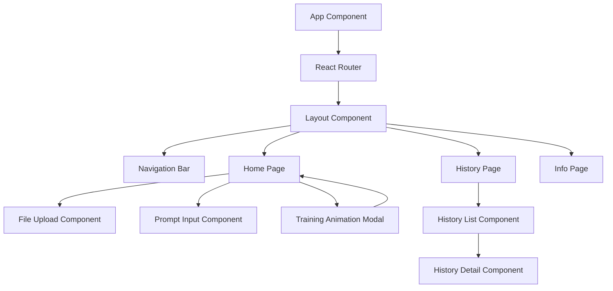

# Frontend Design Document

## Overview

The frontend is a React-based single-page application (SPA) with multi-page routing that provides an intuitive interface for the Agentic Model Training Platform. It features three main pages (Home, History, Info), uses Google's color palette for visual consistency, and includes interactive animations during model training. The design prioritizes rapid development for hackathon demonstration while maintaining modularity and code quality.

## Architecture

### High-Level Component Structure



### Technology Stack

- **React 18**: Core framework with functional components and hooks
- **TypeScript**: Type safety and better developer experience
- **React Router v6**: Client-side routing for multi-page navigation
- **Material-UI (MUI)**: Component library for consistent UI elements
- **TanStack Query (React Query)**: Server state management and API calls
- **Axios**: HTTP client for backend communication
- **Vite**: Build tool and development server
- **Emotion**: CSS-in-JS styling (comes with MUI)

### Folder Structure

```
frontend/
├── src/
│   ├── main.tsx                 # Application entry point
│   ├── App.tsx                  # Root component with routing
│   ├── components/
│   │   ├── common/
│   │   │   ├── Navigation.tsx   # Navigation bar
│   │   │   ├── Layout.tsx       # Page layout wrapper
│   │   │   └── ErrorBoundary.tsx
│   │   ├── home/
│   │   │   ├── FileUpload.tsx   # File upload component
│   │   │   ├── PromptInput.tsx  # Prompt text input
│   │   │   └── SubmitButton.tsx # Submit action button
│   │   ├── training/
│   │   │   ├── TrainingModal.tsx      # Modal overlay
│   │   │   ├── AnimationStage.tsx     # Stage-specific animations
│   │   │   └── ProgressIndicator.tsx  # Progress bar/spinner
│   │   └── history/
│   │       ├── HistoryList.tsx        # List of past sessions
│   │       ├── HistoryCard.tsx        # Individual session card
│   │       └── SessionDetail.tsx      # Detailed results view
│   ├── pages/
│   │   ├── HomePage.tsx         # Home page container
│   │   ├── HistoryPage.tsx      # History page container
│   │   └── InfoPage.tsx         # Info page container
│   ├── services/
│   │   └── api.ts               # API client and endpoints
│   ├── hooks/
│   │   ├── useTraining.ts       # Training submission hook
│   │   └── useHistory.ts        # History fetching hook
│   ├── types/
│   │   └── index.ts             # TypeScript interfaces
│   ├── theme/
│   │   └── theme.ts             # MUI theme with Google colors
│   └── utils/
│       └── validators.ts        # File validation utilities
├── index.html
├── vite.config.ts
└── tsconfig.json
```

## Components and Interfaces

### 1. Core Application Components

#### App Component
```typescript
// App.tsx
import { BrowserRouter, Routes, Route } from 'react-router-dom';
import { QueryClient, QueryClientProvider } from '@tanstack/react-query';
import { ThemeProvider } from '@mui/material';
import { theme } from './theme/theme';

const queryClient = new QueryClient();

function App() {
  return (
    <QueryClientProvider client={queryClient}>
      <ThemeProvider theme={theme}>
        <BrowserRouter>
          <Routes>
            <Route path="/" element={<Layout />}>
              <Route index element={<HomePage />} />
              <Route path="history" element={<HistoryPage />} />
              <Route path="info" element={<InfoPage />} />
            </Route>
          </Routes>
        </BrowserRouter>
      </ThemeProvider>
    </QueryClientProvider>
  );
}
```

#### Layout Component
```typescript
// components/common/Layout.tsx
interface LayoutProps {
  children: React.ReactNode;
}

export function Layout({ children }: LayoutProps) {
  return (
    <Box sx={{ display: 'flex', flexDirection: 'column', minHeight: '100vh' }}>
      <Navigation />
      <Container component="main" sx={{ flex: 1, py: 4 }}>
        {children}
      </Container>
    </Box>
  );
}
```

#### Navigation Component
```typescript
// components/common/Navigation.tsx
export function Navigation() {
  const location = useLocation();
  
  const navItems = [
    { label: 'Home', path: '/', icon: <HomeIcon /> },
    { label: 'History', path: '/history', icon: <HistoryIcon /> },
    { label: 'Info', path: '/info', icon: <InfoIcon /> }
  ];
  
  return (
    <AppBar position="static">
      <Toolbar>
        <Typography variant="h6" sx={{ flexGrow: 1 }}>
          ML Training Platform
        </Typography>
        {navItems.map(item => (
          <Button
            key={item.path}
            component={Link}
            to={item.path}
            startIcon={item.icon}
            sx={{ 
              color: 'white',
              borderBottom: location.pathname === item.path ? '2px solid white' : 'none'
            }}
          >
            {item.label}
          </Button>
        ))}
      </Toolbar>
    </AppBar>
  );
}
```

### 2. Home Page Components

#### File Upload Component
```typescript
// components/home/FileUpload.tsx
interface FileUploadProps {
  onFileSelect: (file: File) => void;
  selectedFile: File | null;
}

export function FileUpload({ onFileSelect, selectedFile }: FileUploadProps) {
  const handleDrop = (event: React.DragEvent) => {
    event.preventDefault();
    const file = event.dataTransfer.files[0];
    if (validateFile(file)) {
      onFileSelect(file);
    }
  };
  
  return (
    <Paper
      onDrop={handleDrop}
      onDragOver={(e) => e.preventDefault()}
      sx={{
        p: 4,
        border: '2px dashed',
        borderColor: 'primary.main',
        textAlign: 'center',
        cursor: 'pointer'
      }}
    >
      <CloudUploadIcon sx={{ fontSize: 60, color: 'primary.main' }} />
      <Typography>Drag & drop your dataset or click to browse</Typography>
      <input
        type="file"
        hidden
        accept=".csv,.json,.xlsx"
        onChange={(e) => e.target.files && onFileSelect(e.target.files[0])}
      />
      {selectedFile && (
        <Chip label={selectedFile.name} onDelete={() => onFileSelect(null)} />
      )}
    </Paper>
  );
}
```

#### Prompt Input Component
```typescript
// components/home/PromptInput.tsx
interface PromptInputProps {
  value: string;
  onChange: (value: string) => void;
}

export function PromptInput({ value, onChange }: PromptInputProps) {
  return (
    <TextField
      fullWidth
      multiline
      rows={4}
      label="Training Instructions"
      placeholder="Describe what you want the model to learn..."
      value={value}
      onChange={(e) => onChange(e.target.value)}
      sx={{ mt: 3 }}
    />
  );
}
```

#### Home Page Container
```typescript
// pages/HomePage.tsx
export function HomePage() {
  const [file, setFile] = useState<File | null>(null);
  const [prompt, setPrompt] = useState('');
  const [isTraining, setIsTraining] = useState(false);
  const { mutate: submitTraining } = useTraining();
  
  const handleSubmit = () => {
    if (file && prompt) {
      setIsTraining(true);
      submitTraining({ file, prompt });
    }
  };
  
  return (
    <Box>
      <Typography variant="h4" gutterBottom>
        Start Model Training
      </Typography>
      <FileUpload onFileSelect={setFile} selectedFile={file} />
      <PromptInput value={prompt} onChange={setPrompt} />
      <Button
        variant="contained"
        size="large"
        onClick={handleSubmit}
        disabled={!file || !prompt}
        sx={{ mt: 3 }}
      >
        Start Training
      </Button>
      {isTraining && <TrainingModal />}
    </Box>
  );
}
```

### 3. Training Animation Components

#### Training Modal Component
```typescript
// components/training/TrainingModal.tsx
interface TrainingStage {
  name: string;
  message: string;
  icon: React.ReactNode;
  color: string;
}

const stages: TrainingStage[] = [
  { 
    name: 'analyzing', 
    message: 'Analyzing your dataset...', 
    icon: <AnalyticsIcon />,
    color: '#4285F4' // Google Blue
  },
  { 
    name: 'processing', 
    message: 'Processing and preparing data...', 
    icon: <DataIcon />,
    color: '#34A853' // Google Green
  },
  { 
    name: 'training', 
    message: 'Training your model...', 
    icon: <ModelTrainingIcon />,
    color: '#FBBC04' // Google Yellow
  },
  { 
    name: 'evaluating', 
    message: 'Evaluating model performance...', 
    icon: <AssessmentIcon />,
    color: '#EA4335' // Google Red
  }
];

export function TrainingModal() {
  const [currentStage, setCurrentStage] = useState(0);
  
  return (
    <Modal open={true}>
      <Box sx={{
        position: 'absolute',
        top: '50%',
        left: '50%',
        transform: 'translate(-50%, -50%)',
        width: 500,
        bgcolor: 'background.paper',
        borderRadius: 2,
        p: 4
      }}>
        <AnimationStage stage={stages[currentStage]} />
        <LinearProgress 
          variant="determinate" 
          value={(currentStage / stages.length) * 100}
          sx={{ mt: 3 }}
        />
      </Box>
    </Modal>
  );
}
```

#### Animation Stage Component
```typescript
// components/training/AnimationStage.tsx
interface AnimationStageProps {
  stage: TrainingStage;
}

export function AnimationStage({ stage }: AnimationStageProps) {
  return (
    <Box sx={{ textAlign: 'center' }}>
      <Box
        sx={{
          display: 'inline-flex',
          p: 3,
          borderRadius: '50%',
          bgcolor: `${stage.color}20`,
          animation: 'pulse 2s infinite'
        }}
      >
        {React.cloneElement(stage.icon, { 
          sx: { fontSize: 60, color: stage.color } 
        })}
      </Box>
      <Typography variant="h6" sx={{ mt: 2 }}>
        {stage.message}
      </Typography>
    </Box>
  );
}
```

### 4. History Page Components

#### History List Component
```typescript
// components/history/HistoryList.tsx
export function HistoryList() {
  const { data: sessions, isLoading } = useHistory();
  const [selectedSession, setSelectedSession] = useState<string | null>(null);
  
  if (isLoading) return <CircularProgress />;
  
  if (!sessions || sessions.length === 0) {
    return (
      <Box sx={{ textAlign: 'center', py: 8 }}>
        <HistoryIcon sx={{ fontSize: 80, color: 'text.secondary' }} />
        <Typography variant="h6" color="text.secondary">
          No training history yet
        </Typography>
      </Box>
    );
  }
  
  return (
    <Grid container spacing={3}>
      {sessions.map(session => (
        <Grid item xs={12} md={6} key={session.id}>
          <HistoryCard 
            session={session} 
            onClick={() => setSelectedSession(session.id)}
          />
        </Grid>
      ))}
      {selectedSession && (
        <SessionDetail 
          sessionId={selectedSession}
          onClose={() => setSelectedSession(null)}
        />
      )}
    </Grid>
  );
}
```

#### History Card Component
```typescript
// components/history/HistoryCard.tsx
interface HistoryCardProps {
  session: TrainingSession;
  onClick: () => void;
}

export function HistoryCard({ session, onClick }: HistoryCardProps) {
  const statusColor = {
    completed: '#34A853',
    failed: '#EA4335',
    training: '#FBBC04'
  }[session.status];
  
  return (
    <Card onClick={onClick} sx={{ cursor: 'pointer', '&:hover': { boxShadow: 6 } }}>
      <CardContent>
        <Box sx={{ display: 'flex', justifyContent: 'space-between', mb: 2 }}>
          <Typography variant="h6">{session.datasetName}</Typography>
          <Chip 
            label={session.status} 
            sx={{ bgcolor: statusColor, color: 'white' }}
          />
        </Box>
        <Typography color="text.secondary" variant="body2">
          {new Date(session.timestamp).toLocaleString()}
        </Typography>
        {session.metrics && (
          <Box sx={{ mt: 2 }}>
            <Typography variant="body2">
              Accuracy: {(session.metrics.accuracy * 100).toFixed(1)}%
            </Typography>
          </Box>
        )}
      </CardContent>
    </Card>
  );
}
```

### 5. Info Page Component

```typescript
// pages/InfoPage.tsx
export function InfoPage() {
  return (
    <Box>
      <Typography variant="h4" gutterBottom>
        About the Platform
      </Typography>
      
      <Paper sx={{ p: 3, mt: 3 }}>
        <Typography variant="h6" gutterBottom>
          What is this?
        </Typography>
        <Typography paragraph>
          An AI-powered platform that automatically trains machine learning models
          from your data. Just upload your dataset and describe what you want to learn.
        </Typography>
      </Paper>
      
      <Paper sx={{ p: 3, mt: 3 }}>
        <Typography variant="h6" gutterBottom>
          How to use
        </Typography>
        <List>
          <ListItem>
            <ListItemIcon><CheckIcon sx={{ color: '#34A853' }} /></ListItemIcon>
            <ListItemText primary="Upload your dataset (CSV, JSON, or Excel)" />
          </ListItem>
          <ListItem>
            <ListItemIcon><CheckIcon sx={{ color: '#34A853' }} /></ListItemIcon>
            <ListItemText primary="Describe what you want the model to predict" />
          </ListItem>
          <ListItem>
            <ListItemIcon><CheckIcon sx={{ color: '#34A853' }} /></ListItemIcon>
            <ListItemText primary="Click 'Start Training' and watch the magic happen" />
          </ListItem>
        </List>
      </Paper>
      
      <Paper sx={{ p: 3, mt: 3 }}>
        <Typography variant="h6" gutterBottom>
          Features
        </Typography>
        <Grid container spacing={2}>
          <Grid item xs={12} md={6}>
            <Box sx={{ display: 'flex', alignItems: 'center', gap: 1 }}>
              <AutoAwesomeIcon sx={{ color: '#4285F4' }} />
              <Typography>Automatic model selection</Typography>
            </Box>
          </Grid>
          <Grid item xs={12} md={6}>
            <Box sx={{ display: 'flex', alignItems: 'center', gap: 1 }}>
              <SpeedIcon sx={{ color: '#FBBC04' }} />
              <Typography>Fast training with Vertex AI</Typography>
            </Box>
          </Grid>
        </Grid>
      </Paper>
    </Box>
  );
}
```

## Data Models

### TypeScript Interfaces

```typescript
// types/index.ts

export interface TrainingSession {
  id: string;
  datasetName: string;
  prompt: string;
  status: 'training' | 'completed' | 'failed';
  timestamp: string;
  metrics?: {
    accuracy: number;
    precision?: number;
    recall?: number;
  };
  modelId?: string;
}

export interface TrainingSubmission {
  file: File;
  prompt: string;
}

export interface TrainingProgress {
  stage: 'analyzing' | 'processing' | 'training' | 'evaluating';
  progress: number;
  message: string;
}

export interface ModelResults {
  modelId: string;
  downloadUrl: string;
  apiEndpoint?: string;
  metrics: {
    accuracy: number;
    [key: string]: number;
  };
}
```

## API Integration

### API Client Setup

```typescript
// services/api.ts
import axios from 'axios';

const API_BASE_URL = import.meta.env.VITE_API_URL || 'http://localhost:8000/api/v1';

export const apiClient = axios.create({
  baseURL: API_BASE_URL,
  headers: {
    'Content-Type': 'application/json'
  }
});

// Training endpoints
export const trainingApi = {
  submit: async (data: FormData) => {
    const response = await apiClient.post('/projects', data, {
      headers: { 'Content-Type': 'multipart/form-data' }
    });
    return response.data;
  },
  
  getProgress: async (projectId: string) => {
    const response = await apiClient.get(`/projects/${projectId}/progress`);
    return response.data;
  }
};

// History endpoints
export const historyApi = {
  getAll: async () => {
    const response = await apiClient.get('/projects');
    return response.data;
  },
  
  getById: async (id: string) => {
    const response = await apiClient.get(`/projects/${id}`);
    return response.data;
  }
};
```

### React Query Hooks

```typescript
// hooks/useTraining.ts
import { useMutation } from '@tanstack/react-query';
import { trainingApi } from '../services/api';

export function useTraining() {
  return useMutation({
    mutationFn: async ({ file, prompt }: TrainingSubmission) => {
      const formData = new FormData();
      formData.append('file', file);
      formData.append('problemDescription', prompt);
      return trainingApi.submit(formData);
    },
    onSuccess: (data) => {
      console.log('Training started:', data);
    },
    onError: (error) => {
      console.error('Training failed:', error);
    }
  });
}

// hooks/useHistory.ts
import { useQuery } from '@tanstack/react-query';
import { historyApi } from '../services/api';

export function useHistory() {
  return useQuery({
    queryKey: ['training-history'],
    queryFn: historyApi.getAll,
    refetchInterval: 30000 // Refetch every 30 seconds
  });
}
```

## Theme Configuration

### Google Color Palette Theme

```typescript
// theme/theme.ts
import { createTheme } from '@mui/material/styles';

export const theme = createTheme({
  palette: {
    primary: {
      main: '#4285F4', // Google Blue
      light: '#669DF6',
      dark: '#1967D2'
    },
    secondary: {
      main: '#34A853', // Google Green
      light: '#5BB974',
      dark: '#0D652D'
    },
    error: {
      main: '#EA4335', // Google Red
      light: '#EE675C',
      dark: '#C5221F'
    },
    warning: {
      main: '#FBBC04', // Google Yellow
      light: '#FCC934',
      dark: '#F29900'
    },
    background: {
      default: '#FFFFFF',
      paper: '#F8F9FA'
    }
  },
  typography: {
    fontFamily: '"Roboto", "Helvetica", "Arial", sans-serif',
    h4: {
      fontWeight: 500
    },
    h6: {
      fontWeight: 500
    }
  },
  components: {
    MuiButton: {
      styleOverrides: {
        root: {
          textTransform: 'none',
          borderRadius: 8
        }
      }
    },
    MuiCard: {
      styleOverrides: {
        root: {
          borderRadius: 12
        }
      }
    }
  }
});
```

## Error Handling

### Error Boundary Component

```typescript
// components/common/ErrorBoundary.tsx
export class ErrorBoundary extends React.Component<
  { children: React.ReactNode },
  { hasError: boolean; error?: Error }
> {
  state = { hasError: false, error: undefined };
  
  static getDerivedStateFromError(error: Error) {
    return { hasError: true, error };
  }
  
  render() {
    if (this.state.hasError) {
      return (
        <Box sx={{ p: 4, textAlign: 'center' }}>
          <ErrorIcon sx={{ fontSize: 60, color: 'error.main' }} />
          <Typography variant="h6">Something went wrong</Typography>
          <Button onClick={() => window.location.reload()}>
            Reload Page
          </Button>
        </Box>
      );
    }
    return this.props.children;
  }
}
```

### API Error Handling

```typescript
// services/api.ts (continued)
apiClient.interceptors.response.use(
  response => response,
  error => {
    if (error.response?.status === 401) {
      // Handle unauthorized
      window.location.href = '/login';
    } else if (error.response?.status >= 500) {
      // Show server error message
      console.error('Server error:', error);
    }
    return Promise.reject(error);
  }
);
```

## Testing Strategy

### Component Testing
- Test file upload validation
- Test form submission
- Test navigation between pages
- Test error states
- Use React Testing Library

### Integration Testing
- Test API integration with mock server
- Test React Query hooks
- Test routing behavior

### Testing Tools
- Vitest for test runner
- React Testing Library for component tests
- MSW (Mock Service Worker) for API mocking

## Performance Optimization

### Code Splitting
```typescript
// Lazy load pages
const HomePage = lazy(() => import('./pages/HomePage'));
const HistoryPage = lazy(() => import('./pages/HistoryPage'));
const InfoPage = lazy(() => import('./pages/InfoPage'));
```

### Memoization
```typescript
// Memoize expensive computations
const processedData = useMemo(() => {
  return expensiveOperation(data);
}, [data]);
```

### Debouncing
```typescript
// Debounce search/filter inputs
const debouncedSearch = useDebouncedValue(searchTerm, 300);
```

## Responsive Design

### Breakpoints
- Mobile: < 600px
- Tablet: 600px - 960px
- Desktop: > 960px

### Responsive Patterns
```typescript
// Use MUI responsive props
<Grid container spacing={{ xs: 2, md: 3 }}>
  <Grid item xs={12} md={6}>
    {/* Content */}
  </Grid>
</Grid>

// Use sx prop for responsive styles
<Box sx={{
  p: { xs: 2, md: 4 },
  fontSize: { xs: '14px', md: '16px' }
}}>
```

## Build Configuration

### Vite Config
```typescript
// vite.config.ts
import { defineConfig } from 'vite';
import react from '@vitejs/plugin-react';

export default defineConfig({
  plugins: [react()],
  server: {
    port: 3000,
    proxy: {
      '/api': {
        target: 'http://localhost:8000',
        changeOrigin: true
      }
    }
  },
  build: {
    outDir: 'dist',
    sourcemap: true
  }
});
```

### TypeScript Config
```json
// tsconfig.json
{
  "compilerOptions": {
    "target": "ES2020",
    "useDefineForClassFields": true,
    "lib": ["ES2020", "DOM", "DOM.Iterable"],
    "module": "ESNext",
    "skipLibCheck": true,
    "moduleResolution": "bundler",
    "allowImportingTsExtensions": true,
    "resolveJsonModule": true,
    "isolatedModules": true,
    "noEmit": true,
    "jsx": "react-jsx",
    "strict": true,
    "noUnusedLocals": true,
    "noUnusedParameters": true,
    "noFallthroughCasesInSwitch": true
  },
  "include": ["src"],
  "references": [{ "path": "./tsconfig.node.json" }]
}
```

## Deployment

### Docker Configuration
```dockerfile
# Dockerfile
FROM node:18-alpine as build
WORKDIR /app
COPY package*.json ./
RUN npm ci
COPY . .
RUN npm run build

FROM nginx:alpine
COPY --from=build /app/dist /usr/share/nginx/html
COPY nginx.conf /etc/nginx/conf.d/default.conf
EXPOSE 80
CMD ["nginx", "-g", "daemon off;"]
```

### Environment Variables
```bash
# .env
VITE_API_URL=http://localhost:8000/api/v1
```
